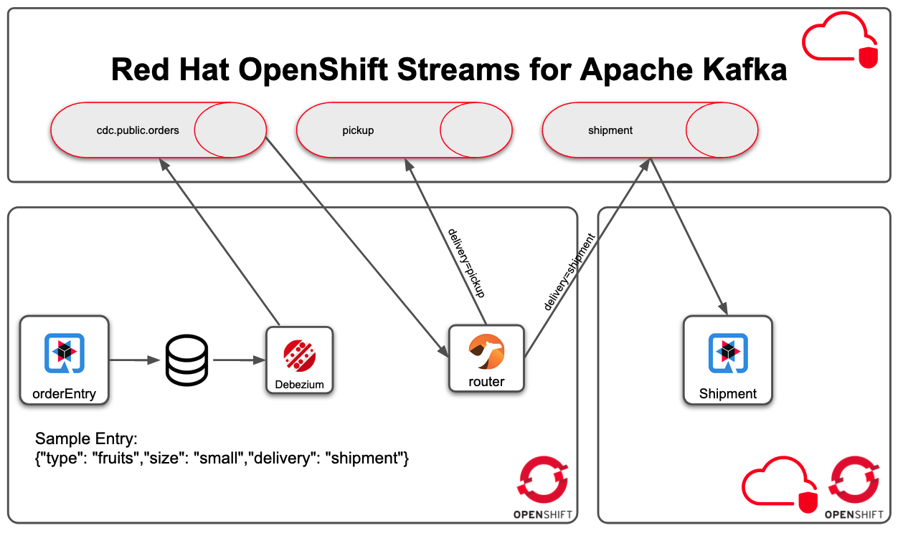

# RHOSAK CDC Demo
This repo use Red Hat Openshift Streams for Apache Kafka (aka RHOSAK) to enable change data capture 



## Prerequisite

### Red Hat Openshift Application Service
You can choose to create a new kafka instance via web-ui or using the rhoas cli      
To install the rhoas cli refer to [rhoas cli](https://github.com/redhat-developer/app-services-cli) 

### Red Hat Openshit Strams for Apache Kafka 
Go to cloud.redhat.com and create a new Kafka Instances
alternatively you can use below commands that use the rhoas cli
```shell script
rhoas kafka create --name cdc-demo
rhoas context set-kafka --name cdc-demo
```

### Create Project on openshift
```
oc project rhosak-cdc-demo
```

Follow the README in order to create the infrastructure
- [CDC](cdc/README.md)
- [Order-Entry](orderEntry/README.md)
- [UI](ui/README.md)
- [Router](router/README.md)
- [Shipment](shipment/README.md)
