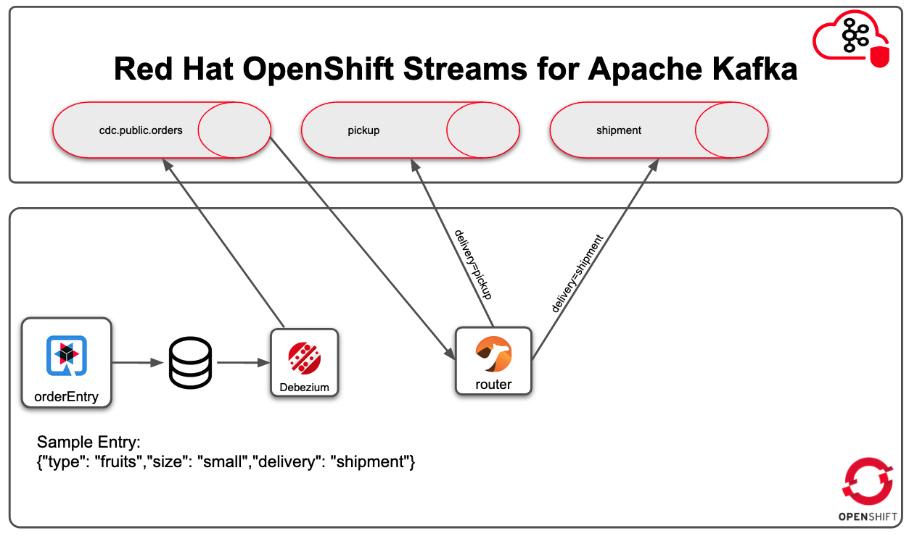

# Router
This project uses Quarkus with camel extension in order to consume messages from Kafka Topic emitted by Debezium, implements content based routing to determinate the right topic to send the message



## Pre Requisite
You must have configured a Red Hat Openshift Streams for Apache Kafka

### Create Topic
You can create topics via web ui or alternatively you can use the rhoas cli
```
rhoas kafka topic create --name shipment
rhoas kafka topic create --name pickup
```

### Service Account
Create service account   
Service Account for this project will have this acl:

| Topic Name | Grant |
|----------|:-------------:|
| cdc.public.orders | consumer |
| shipment | producer |
| pickup | producer |

```shell
rhoas service-account create --short-description router-sa --file-format env --output-file /tmp/router-sa.env
cat /tmp/router-sa.env
```

Give the right acl
```
rhoas kafka acl grant-access --producer --service-account <CLIENT-ID>  --topic shipment
rhoas kafka acl grant-access --producer --service-account <CLIENT-ID>  --topic pickup
rhoas kafka acl grant-access --consumer --service-account <CLIENT-ID>  --topic cdc.public.orders --group router
```
- Sample
```
rhoas kafka acl grant-access --producer --service-account 5470b9ae-b472-4674-8084-0511b4f6528a  --topic shipment
rhoas kafka acl grant-access --producer --service-account 5470b9ae-b472-4674-8084-0511b4f6528a  --topic pickup
rhoas kafka acl grant-access --consumer --service-account 5470b9ae-b472-4674-8084-0511b4f6528a  --topic cdc.public.orders --group router
```

Now you need to get the Bootstap server URL, Client ID and Client Secret then modify the file [application.properties](src/main/resources/application.properties)       
Client ID and Client Secret could be obtained from file router-sa.env created by command 'rhoas service-account create'

```
rhosak.bootstrap.servers=Bootstap server URL
rhosak.client.id=Client ID
rhosak.client.secret=Client Secret
```

## Run Application Locally
```shell
mvn compile quarkus:dev
```

## Packaging and deploy the application
### First Build
```shell script
mvn clean package -Dquarkus.package.type=uber-jar
oc new-build --name=cdc-router --binary=true -i=java:openjdk-11-ubi8
oc start-build cdc-router --from-file=target/cdc-router-1.0.0-SNAPSHOT-runner.jar --follow
oc new-app cdc-router
```
### Re-Build
```shell script
mvn clean package -Dquarkus.package.type=uber-jar
oc start-build cdc-router --from-file=target/cdc-router-1.0.0-SNAPSHOT-runner.jar --follow
```